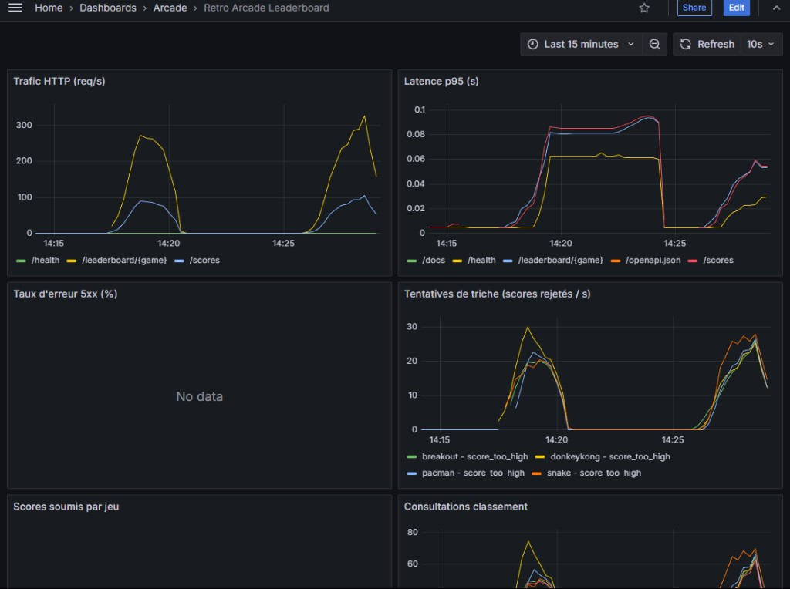
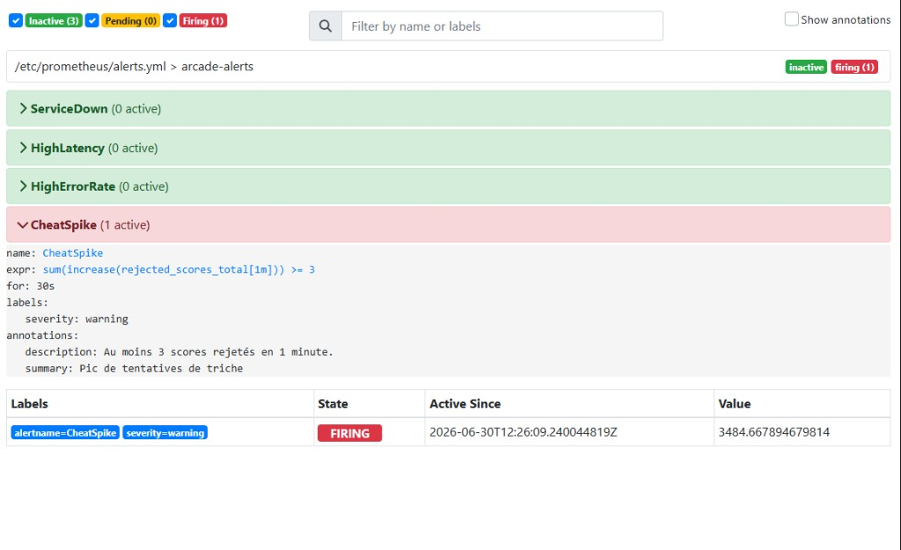
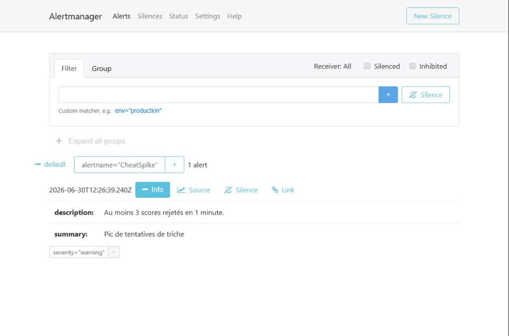

# Retro Arcade Leaderboard

Projet d'éval DevOps : une petite API de classement pour des jeux d'arcade (Pac-Man, Tetris, Snake, Breakout, Donkey Kong).

J'ai fait ça en **Python + FastAPI**, avec **SQLite** pour garder les scores, le tout dans **Docker**. Y'a aussi **Prometheus**, **Grafana** et **Alertmanager** pour le monitoring parce que c'était demandé dans le sujet.

[](https://sonarcloud.io/summary/new_code?id=ogtayaliyev_mewo-devops-ogtay-celia)

Repo : https://github.com/ogtayaliyev/mewo-devops-ogtay-celia

---

## C'est quoi ce projet ?

En gros c'est un back-office de scores. Un joueur envoie son score, l'API vérifie qu'il triche pas, et ça met à jour le classement.

Les règles anti-triche :
- le jeu doit exister (pacman, tetris, snake, breakout, donkeykong)
- le score doit être positif
- le score ne doit pas dépasser le max du jeu (ex: pacman max = 999 999)
- il faut attendre 2 secondes entre deux envois du même joueur sur le même jeu

Les scores max par jeu :
- pacman → 999 999
- tetris → 9 999 999
- snake → 99 999
- breakout → 896 980
- donkeykong → 1 247 700

---

## Comment c'est organisé dans le code

```
app/
  main.py       → les routes FastAPI
  games.py      → la logique métier (validation, cooldown, tri)
  db.py         → SQLite (scores + dernier envoi par joueur/jeu)
  metrics.py    → compteurs Prometheus
  middleware.py → mesure chaque requête HTTP (latence, status code)
monitoring/     → config Prometheus, Grafana, alertes
scripts/        → test de charge
```

La logique métier est dans `games.py` à part, comme ça les tests unitaires sont simples à écrire.

---

## Prérequis

Avant de commencer, il te faut :

- **Git** — pour cloner le repo
- **Python 3.11+** — https://www.python.org/downloads/ (coche "Add Python to PATH" à l'installation sur Windows)
- **Docker Desktop** — https://www.docker.com/products/docker-desktop/ (recommandé, lance API + monitoring d'un coup)

Vérifie que c'est installé :
```powershell
git --version
python --version
docker --version
```

---

## 1. Récupérer le projet

```powershell
git clone https://github.com/Freya-Tenebrae/MEWO_dev_ops.git
cd MEWO_dev_ops
```

---

## 2. Lancer le projet (méthode recommandée → Docker)

C'est la méthode la plus simple : une commande lance **tout** (API, Prometheus, Grafana, Alertmanager).

```powershell
docker compose -f docker-compose.yml -f docker-compose.dev.yml up --build -d
```

Attends ~30 secondes que les conteneurs démarrent. Vérifie :
```powershell
docker compose -f docker-compose.yml -f docker-compose.dev.yml ps
```

Tu dois voir 4 conteneurs **Up** : `api`, `prometheus`, `grafana`, `alertmanager`.

### URLs une fois lancé

- **API / Swagger** : http://localhost:8000/docs
- **Prometheus** : http://localhost:9090
- **Grafana** : http://localhost:3000 → login `admin` / mdp `admin`
- **Alertmanager** : http://localhost:9093

Dashboard Grafana : **Arcade → Retro Arcade Leaderboard** (chargé automatiquement).

### Arrêter / relancer

```powershell
# Arrêter
docker compose -f docker-compose.yml -f docker-compose.dev.yml down

# Relancer
docker compose -f docker-compose.yml -f docker-compose.dev.yml up -d
```

### Mode prod (image figée, pas de hot-reload)

```powershell
docker compose -f docker-compose.yml -f docker-compose.prod.yml up --build -d
```

Diff dev / prod :
- **dev** : code monté en volume, rechargement auto quand tu modifies un fichier
- **prod** : image Docker figée, `restart: unless-stopped`

---

## 3. Lancer en local avec Python (sans Docker)

Utile si tu veux juste coder / debugger l'API. **Attention** : sans Docker tu n'as pas Grafana ni Prometheus.

### Étape 1 — environnement virtuel

```powershell
cd MEWO_dev_ops
python -m venv .venv
.venv\Scripts\activate
```

Tu dois voir `(.venv)` au début de ta ligne de commande.

### Étape 2 — installer les dépendances

```powershell
python -m pip install --upgrade pip
pip install -r requirements-dev.txt
```

Ça installe :
- **FastAPI + Uvicorn** → l'API
- **pytest, ruff, bandit, pip-audit** → tests et qualité de code

### Étape 3 — configurer la base SQLite

Par défaut Docker utilise `/data/leaderboard.db`. En local, pointe vers un dossier du projet :

```powershell
# Windows PowerShell
$env:DB_PATH = "data\leaderboard.db"

# Windows CMD
set DB_PATH=data\leaderboard.db

# Linux / Mac
export DB_PATH=data/leaderboard.db
```

### Étape 4 — lancer l'API

```powershell
python -m uvicorn app.main:app --reload --host 0.0.0.0 --port 8000
```

→ http://localhost:8000/docs

Pour arrêter : `Ctrl + C`

### Étape 5 — lancer les tests (optionnel)

```powershell
pytest -v
ruff check app tests
```

---

## 4. Vérifier que tout marche

```powershell
# Healthcheck
curl http://localhost:8000/health
# → {"status":"ok"}

# Envoyer un score
curl -X POST http://localhost:8000/scores -H "Content-Type: application/json" -d "{\"player\":\"AAA\",\"game\":\"pacman\",\"score\":123456}"

# Voir le classement
curl http://localhost:8000/leaderboard/pacman
```

Ou ouvre http://localhost:8000/docs et teste directement dans Swagger.

---

## Les routes de l'API

- `POST /scores` → envoyer un score `{ "player": "AAA", "game": "pacman", "score": 123456 }`
- `GET /leaderboard/pacman?limit=10` → top 10 du jeu
- `GET /players/AAA` → meilleurs scores du joueur
- `GET /games` → liste des jeux + score max
- `GET /health` → check que l'API répond
- `GET /metrics` → métriques Prometheus

Exemple rapide :
```bash
curl -X POST http://localhost:8000/scores -H "Content-Type: application/json" -d "{\"player\":\"AAA\",\"game\":\"pacman\",\"score\":123456}"
curl http://localhost:8000/leaderboard/pacman
```

---

## Comment marche le monitoring

L'API expose `/metrics` au format Prometheus. À chaque requête, le middleware enregistre :
- combien de requêtes passent (par route et code HTTP)
- la latence (histogramme, pour calculer le p95)
- les scores acceptés (par jeu)
- les scores rejetés (par jeu + motif : score_too_high, cooldown, etc.)
- les consultations de classement

**Prometheus** scrape `/metrics` toutes les 15 secondes.

**Grafana** affiche un dashboard avec le trafic, la latence p95, le taux d'erreur 5xx, et un panneau "tentatives de triche".

**Alertmanager** reçoit les alertes définies dans `monitoring/alerts.yml` :
- **ServiceDown** → l'API ne répond plus
- **HighLatency** → p95 > 500 ms
- **HighErrorRate** → trop de 5xx
- **CheatSpike** → 3 scores rejetés ou plus en 1 minute

Pour montrer une alerte en live, tu peux couper l'API :
```bash
docker compose stop api
# attendre ~30 sec → voir l'alerte sur http://localhost:9090/alerts
docker compose start api
```

Ou simuler de la triche dans Swagger (envoie **3 fois** un score trop haut sur `POST /scores`) :
```json
{"player": "HACK1", "game": "pacman", "score": 9999999}
```
Change le nom du joueur à chaque fois (HACK2, HACK3...) pour éviter le cooldown.
Attends ~30 sec → l'alerte **CheatSpike** passe en Firing sur http://localhost:9090/alerts

---

## Test de charge k6 (Partie 7)

Script : `scripts/load_test.js`

Ce qu'il fait :
- montée progressive : 5 → 25 → 50 utilisateurs virtuels (ramp-up)
- `POST /scores` (scores valides + ~40 % invalides pour simuler la triche)
- `GET /leaderboard/{game}` (consultation des classements)
- observable dans Grafana (trafic, latence p95) et déclenche **CheatSpike** dans Prometheus

### Installer k6 (Windows)

Télécharge sur https://k6.io/docs/get-started/installation/ ou :
```powershell
choco install k6
```

### Lancer le test

Stack Docker déjà up, puis :
```powershell
k6 run scripts/load_test.js
```

Ou via Docker (sans installer k6) :
```powershell
docker compose --profile loadtest run --rm k6
```

Pendant le test, ouvre Grafana (http://localhost:3000) → dashboard **Retro Arcade Leaderboard**.
Tu verras le trafic et la latence monter. À la fin, vérifie http://localhost:9090/alerts → **CheatSpike** en Firing.

### Résultat du test de charge (captures)

J'ai lancé le test k6 via Docker (`docker compose --profile loadtest run --rm k6`). Voici ce qu'on observe :

**1. Grafana — impact de la charge**



On voit bien le ramp-up :
- le **trafic HTTP** monte (pic ~300 req/s sur `/leaderboard/{game}`)
- la **latence p95** augmente (~80-90 ms)
- les **tentatives de triche** explosent (scores rejetés `score_too_high`)
- pas d'erreur 5xx → l'API tient la charge

**2. Prometheus — alerte CheatSpike déclenchée**



Pendant le test, l'alerte **CheatSpike** passe en **FIRING** : plus de 3 scores rejetés en 1 minute (en fait des milliers avec k6). Les 3 autres alertes restent inactives, c'est normal.

**3. Alertmanager — notification reçue**



Prometheus envoie l'alerte à **Alertmanager** qui l'affiche avec le résumé *"Pic de tentatives de triche"*.

> L'alerte retombe en **Inactive** ~1-2 min après la fin du test. Il faut regarder Prometheus **pendant** que k6 tourne, ou garder ces captures pour la démo.

Script Python alternatif (plus simple, sans k6) : `scripts/load_test.py`

---

## Tests et CI

### Tests unitaires (logique métier)

```powershell
pip install -r requirements-dev.txt
pytest -v
```

Avec couverture de code en local :
```powershell
pytest tests/ -v --cov=app --cov-report=term-missing
```

### CI GitHub Actions

Pipeline `.github/workflows/ci.yml` à chaque push :
1. install des deps
2. ruff (lint)
3. pytest + couverture (affichée dans les logs CI)
4. bandit (SAST)
5. pip-audit (CVE)
6. build Docker + scan Trivy

### SonarCloud

La couverture et les résultats de tests sont publiés dans la CI via `coverage.xml` et `test-results.xml`, puis importés par le scan SonarCloud déclenché dans GitHub Actions.

---

## Si Grafana ou Alertmanager ne marchent pas

Ça m'est arrivé : j'avais lancé Docker avant d'ajouter Grafana. Il faut relancer toute la stack :

```bash
docker compose -f docker-compose.yml -f docker-compose.dev.yml up --build -d
```

Dans Docker Desktop, cherche le groupe **arcade-leaderboard** — tu dois voir 4 conteneurs (api, prometheus, grafana, alertmanager).

Si tu vois rien, vide le filtre de recherche dans Docker Desktop (ça m'a bloqué un moment).

---

## Auteur

Projet réalisé dans le cadre de l'évaluation DevOps MEWO.
